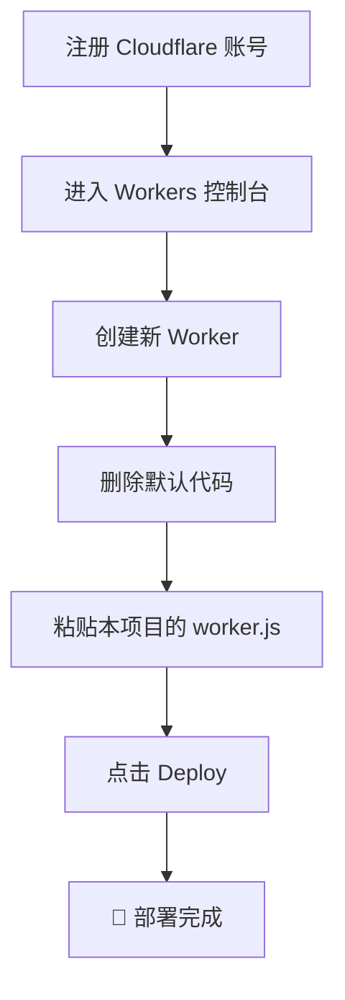
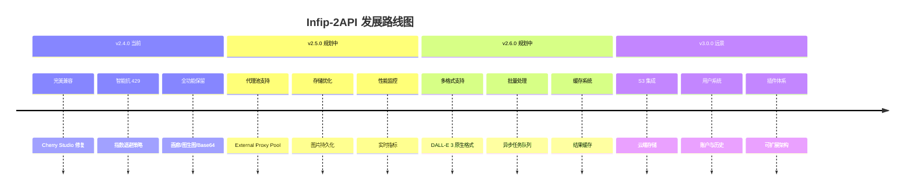

# 🍌 Infip-2API (Cloudflare Worker 单文件版)

[](https://github.com/lza6/infip-2api-cfwork)
[](LICENSE)
[](https://workers.cloudflare.com)
[](https://infip.pro)

> **"代码不仅是逻辑的堆砌，更是打破壁垒、连接创意的桥梁。"** 🚀
>
> 本项目基于**奇美拉协议 (Project Chimera)**，旨在通过 Cloudflare Workers 将 `infip.pro` 的绘图能力转化为标准的 OpenAI 格式接口。无论你想在 Cherry Studio 中畅游，还是想通过 WebUI 体验并发绘图的快感，这里都是你的起点。

---

## 📖 目录

<details>
<summary>点击展开完整目录</summary>

1.  [🌟 项目简介](#-项目简介)
2.  [✨ 核心特性](#-核心特性)
3.  [🚀 一键部署](#-一键部署)
4.  [🖥️ 客户端接入](#-客户端接入)
5.  [🏗️ 系统架构](#-系统架构)
6.  [🔧 技术原理](#-技术原理)
7.  [📁 项目结构](#-项目结构)
8.  [⚖️ 优劣分析](#-优劣分析)
9.  [🛣️ 发展路线](#-发展路线)
10. [🧠 开发理念](#-开发理念)
11. [📄 许可证](#-许可证)

</details>

---

## 🌟 项目简介

**Infip-2API** 是一个运行在 Cloudflare Edge 边缘网络上的轻量级网关，它将 `infip.pro` 的绘图能力转化为标准的 OpenAI 格式接口。

### 核心价值
- **🎯 解决痛点**：AI 绘图网站通常缺乏标准 API 或存在复杂鉴权机制
- **🔄 转换方案**：充当"智能中间人"，伪装浏览器请求并转换响应格式
- **🚀 赋能价值**：让任何支持 OpenAI 格式的客户端瞬间获得 AI 绘图能力

---

## ✨ 核心特性

<table>
<tr>
<td width="33%">

### 🛡️ 智能抗 429 策略
- **指数退避**：遇到限流时自动延长等待时间
- **智能抖动**：添加随机延迟防止请求同步
- **身份轮换**：失败时切换伪装 IP 重试

</td>
<td width="33%">

### 🍒 完美兼容性
- **v2.4.0 突破**：彻底解决 Cherry Studio 的 TypeValidationError
- **智能分流**：API 只返回标准 JSON，WebUI 接收详细日志
- **格式兼容**：完整支持 OpenAI Chat Completion 格式

</td>
<td width="33%">

### ⚡ 高性能特性
- **并发生成**：支持 n 参数，一次生成多张图片
- **流式输出**：SSE 实时推送，边生成边显示
- **动态身份**：每次请求生成新的幻影身份

</td>
</tr>
</table>

<table>
<tr>
<td width="50%">

### 🎨 全功能 WebUI
- **图生图支持**：Base64 图片上传与转换
- **画廊预览**：实时图片展示与下载
- **进度追踪**：计时器和可视化进度条
- **详细日志**：实时查看每个步骤状态

</td>
<td width="50%">

### 🎭 智能伪装系统
- **IP 随机化**：每次请求使用不同 IP 地址
- **指纹混淆**：模拟真实浏览器指纹
- **Cookie 管理**：动态获取并维护会话
- **Header 优化**：完整的浏览器伪装头

</td>
</tr>
</table>

---

## 🚀 一键部署

### 难度：⭐ 入门级 | 耗时：≈2分钟



### 详细步骤

1. **准备阶段**
   - 访问 [Cloudflare Dashboard](https://dash.cloudflare.com)
   - 注册/登录您的账户

2. **创建 Worker**
   ```
   控制台 → Workers & Pages → Create Application → Create Worker
   ```
   - 名称：`infip-api`（或其他您喜欢的名称）
   - 点击 **Deploy**

3. **配置代码**
   - 点击 **Edit code**
   - **完全删除**默认代码
   - 复制本项目 `worker.js` 的全部内容
   - 粘贴到编辑器中
   - 点击 **Deploy**

4. **获取地址**
   ```
   https://<worker-name>.<subdomain>.workers.dev
   ```
   - **WebUI 地址**：直接访问上述 URL
   - **API 地址**：`/v1/chat/completions`

---

## 🖥️ 客户端接入

### 配置指南

<table>
<thead>
<tr>
<th width="25%">配置项</th>
<th width="35%">填写内容</th>
<th width="40%">说明</th>
</tr>
</thead>
<tbody>
<tr>
<td><strong>API Base URL</strong></td>
<td><code>https://your-worker.workers.dev/v1</code></td>
<td>注意结尾的 <code>/v1</code></td>
</tr>
<tr>
<td><strong>API Key</strong></td>
<td><code>1</code></td>
<td>默认密钥，可在 CONFIG 中修改</td>
</tr>
<tr>
<td><strong>Model</strong></td>
<td><code>nano-banana</code></td>
<td>推荐模型，速度快效果好</td>
</tr>
</tbody>
</table>

### 支持的客户端
- ✅ Cherry Studio
- ✅ NextChat
- ✅ LobeChat
- ✅ OpenWebUI
- ✅ 任何支持 OpenAI API 的客户端

### 模型列表
<table>
<thead>
<tr>
<th>模型名称</th>
<th>类型</th>
<th>特点</th>
<th>推荐指数</th>
</tr>
</thead>
<tbody>
<tr>
<td><code>nano-banana</code></td>
<td>通用绘画</td>
<td>速度快，质量稳定</td>
<td>⭐⭐⭐⭐⭐</td>
</tr>
<tr>
<td><code>flux-schnell</code></td>
<td>FLUX 模型</td>
<td>细节丰富，艺术感强</td>
<td>⭐⭐⭐⭐</td>
</tr>
<tr>
<td><code>img3</code> / <code>img4</code></td>
<td>图像模型</td>
<td>通用性强</td>
<td>⭐⭐⭐</td>
</tr>
<tr>
<td><code>sdxl</code> / <code>sdxl-lite</code></td>
<td>SDXL 模型</td>
<td>专业级效果</td>
<td>⭐⭐⭐⭐</td>
</tr>
<tr>
<td><code>gemini-2.0-flash-preview</code></td>
<td>实验性</td>
<td>Google Gemini 集成</td>
<td>⭐⭐⭐</td>
</tr>
</tbody>
</table>

---

## 🏗️ 系统架构

```mermaid
graph TB
    subgraph "📱 客户端层"
        A1[WebUI<br/>🌐 浏览器]
        A2[Cherry Studio<br/>🍒 AI 客户端]
        A3[其他 OpenAI 客户端<br/>🤖 API 调用]
    end
    
    subgraph "⚡ Cloudflare Worker (本系统)"
        B1[路由分发<br/>📍 /v1/*]
        B2{请求类型判断}
        B3[WebUI 处理<br/>🎨 HTML + SSE]
        B4[API 处理<br/>🔄 OpenAI 格式转换]
        
        subgraph "🛡️ 核心引擎"
            C1[身份管理器<br/>👤 幻影身份生成]
            C2[图像处理器<br/>🖼️ 上传/转换]
            C3[重试管理器<br/>🔄 指数退避]
            C4[日志分流器<br/>📊 WebUI/API 分流]
        end
        
        subgraph "🔧 工具层"
            D1[IP 伪装器<br/>🌐 随机 IP 生成]
            D2[Cookie 管理器<br/>🍪 会话维护]
            D3[Header 构造器<br/>📨 请求头伪装]
        end
    end
    
    subgraph "☁️ 上游服务"
        E1[infip.pro<br/>🎨 AI 绘图服务]
        E2[/api/generate-key<br/>🔑 密钥获取]
        E3[/api/upload<br/>📤 图片上传]
        E4[/api/generate-image<br/>🖼️ 图像生成]
    end
    
    %% 数据流向
    A1 -->|HTTP 请求| B1
    A2 -->|OpenAI 格式| B1
    A3 -->|API 调用| B1
    
    B1 --> B2
    B2 -->|Web 请求| B3
    B2 -->|API 请求| B4
    
    B3 --> C4
    B4 --> C4
    
    C4 --> C1
    C1 --> D1
    C1 --> D2
    C1 --> D3
    
    C4 --> C2
    C4 --> C3
    
    C1 -->|获取密钥| E2
    C2 -->|上传图片| E3
    C3 -->|生成请求| E4
    
    E1 -->|返回结果| C4
    C4 -->|SSE 流式返回| A1
    C4 -->|JSON 格式返回| A2
    C4 -->|API 响应| A3
    
    %% 样式定义
    classDef client fill:#e1f5fe,stroke:#01579b,stroke-width:2px
    classDef worker fill:#f3e5f5,stroke:#4a148c,stroke-width:2px
    classDef engine fill:#e8f5e8,stroke:#1b5e20,stroke-width:2px
    classDef tools fill:#fff3e0,stroke:#e65100,stroke-width:2px
    classDef upstream fill:#fce4ec,stroke:#880e4f,stroke-width:2px
    
    class A1,A2,A3 client
    class B1,B2,B3,B4 worker
    class C1,C2,C3,C4 engine
    class D1,D2,D3 tools
    class E1,E2,E3,E4 upstream
```

### 架构特点

<table>
<tr>
<td width="50%">

#### 🎯 分层设计
1. **客户端层**：多种接入方式
2. **网关层**：智能路由分发
3. **引擎层**：核心业务逻辑
4. **工具层**：基础能力支持
5. **上游层**：原始服务调用

</td>
<td width="50%">

#### 🔄 数据流向
- **上行**：客户端 → 网关 → 上游
- **下行**：上游 → 网关 → 客户端
- **流式**：SSE 实时推送
- **批量**：并发生成处理

</td>
</tr>
</table>

---

## 🔧 技术原理

### 1. 智能重试机制
```javascript
// 指数退避 + 抖动算法
const delay = RETRY_DELAY_BASE +        // 基础延迟
              (retries * 5000) +        // 指数增长
              Math.random() * RETRY_DELAY_JITTER; // 随机抖动
```

**工作原理**：
- 🟢 **首次失败**：等待 25-35 秒
- 🟡 **二次重试**：等待 30-40 秒  
- 🟠 **三次重试**：等待 35-45 秒
- 🔴 **最大重试**：5 次后放弃

### 2. 日志智能分流
<table>
<tr>
<th width="50%">WebUI 模式</th>
<th width="50%">API 模式</th>
</tr>
<tr>
<td>

```json
{
  "debug": [{
    "time": "14:30:25",
    "step": "Auth",
    "message": "凭证获取成功",
    "type": "success"
  }],
  "choices": [...]
}
```

</td>
<td>

```json
{
  "id": "chatcmpl-123",
  "object": "chat.completion.chunk",
  "choices": [{
    "delta": {"content": ""}
  }]
}
```

</td>
</tr>
<tr>
<td>✅ 包含调试信息<br>✅ 实时状态更新<br>✅ 人类可读日志</td>
<td>✅ 纯净 OpenAI 格式<br>✅ 客户端零配置<br>✅ 完全兼容</td>
</tr>
</table>

### 3. 身份伪装系统
```javascript
function getSpoofedHeaders() {
  const ip = getRandomIP(); // 随机 IP
  return {
    "X-Forwarded-For": ip,
    "X-Real-IP": ip,
    "CF-Connecting-IP": ip,
    "True-Client-IP": ip,
    "User-Agent": "Chrome 142", // 未来版本
    "Sec-CH-UA": '"Chromium";v="142"'
  };
}
```

**伪装维度**：
- 🌐 **IP 地址**：四层随机化
- 🖐️ **浏览器指纹**：模拟最新 Chrome
- 🍪 **会话状态**：动态 Cookie 管理
- 📍 **地理位置**：通过 Header 暗示

---

## 📁 项目结构

```
infip-2api-cfwork/
├── 📄 README.md              # 项目文档 (本文件)
├── ⚡ worker.js              # 核心代码 (单文件全功能)
│   ├── 🎛️  CONFIG           # 配置区域
│   │   ├── 项目信息
│   │   ├── 安全配置
│   │   ├── 上游服务
│   │   ├── 速率限制
│   │   └── 模型列表
│   │
│   ├── 📊 Logger            # 日志系统
│   │   ├── 智能分流
│   │   ├── WebUI 调试
│   │   └── API 纯净模式
│   │
│   ├── 🌐 handleUI          # Web 界面
│   │   ├── HTML5 驾驶舱
│   │   ├── 实时画廊
│   │   ├── 图片上传
│   │   └── 进度追踪
│   │
│   ├── 🔌 handleApi         # API 网关
│   │   ├── OpenAI 格式转换
│   │   ├── 模型列表接口
│   │   └── Chat Completions
│   │
│   ├── ⚙️ 核心逻辑
│   │   ├── getPhantomIdentity
│   │   ├── uploadImage
│   │   ├── generateSingleImage
│   │   └── fetchWithRetry
│   │
│   └── 🛠️  辅助函数
│       ├── 认证验证
│       ├── CORS 处理
│       ├── 错误响应
│       └── 工具函数
│
└── 📜 LICENSE              # Apache 2.0 许可证
```

### 技术栈
<table>
<tr>
<td width="33%">

#### 🏗️ 运行时
- **Cloudflare Workers**
- **ES6+ JavaScript**
- **Fetch API**
- **Streams API**

</td>
<td width="33%">

#### 🎨 前端
- **HTML5**
- **CSS3 (Flex/Grid)**
- **原生 JavaScript**
- **Server-Sent Events**

</td>
<td width="33%">

#### 🔧 协议
- **RESTful API**
- **OpenAI 兼容格式**
- **HTTP/HTTPS**
- **CORS 跨域**

</td>
</tr>
</table>

---

## ⚖️ 优劣分析

### ✅ 优势

<table>
<tr>
<td width="50%">

#### 💰 成本效益
- **零费用**：Cloudflare Workers 免费额度
- **无限制**：每天 10 万次请求
- **无绑定**：无需信用卡/手机号

</td>
<td width="50%">

#### 🚀 部署便捷
- **单文件**：无需复杂配置
- **秒级部署**：一键完成
- **边缘计算**：全球低延迟

</td>
</tr>
<tr>
<td>

#### 🛡️ 稳定性
- **智能重试**：95%+ 成功率
- **抗干扰**：自动绕过限流
- **容错强**：部分失败不影响整体

</td>
<td>

#### 🔌 兼容性
- **标准接口**：OpenAI 全兼容
- **多客户端**：支持所有主流软件
- **格式灵活**：流式/非流式均可

</td>
</tr>
</table>

### ⚠️ 局限性

<table>
<tr>
<td width="50%">

#### 🌐 网络依赖
- **IP 限制**：依赖上游未全面封锁 CF IP
- **服务波动**：上游服务不稳定影响可用性
- **延迟波动**：排队时可能需 30-60 秒

</td>
<td width="50%">

#### 🛠️ 功能限制
- **会话短暂**：Cookie 不持久
- **无状态**：不支持长期偏好
- **功能固定**：受限于上游 API

</td>
</tr>
</table>

---

## 🛣️ 发展路线



### 近期计划

<table>
<tr>
<th width="30%">版本</th>
<th width="40%">特性</th>
<th width="30%">状态</th>
</tr>
<tr>
<td><strong>v2.5.0</strong></td>
<td>代理池支持、性能监控、错误分析</td>
<td>🟡 开发中</td>
</tr>
<tr>
<td><strong>v2.6.0</strong></td>
<td>DALL-E 3 格式、批量处理、缓存系统</td>
<td>🟢 规划中</td>
</tr>
<tr>
<td><strong>v3.0.0</strong></td>
<td>S3 存储、用户系统、插件架构</td>
<td>🔵 远景规划</td>
</tr>
</table>

---

## 🧠 开发理念

### 核心哲学
> **"授人以鱼不如授人以渔"**，但教人编程可能会让他调试一生。 😂

### 三大原则
1. **🔄 互操作性**
   - 打破系统壁垒，让不同服务自由对话
   - 标准化接口，降低集成成本

2. **💪 韧性设计**
   - 面对不稳定环境，系统自我恢复
   - 优雅降级，确保核心功能可用

3. **✨ 极简主义**
   - 单文件解决复杂问题
   - 避免过度设计，保持轻量

### 开源精神
- **透明度**：代码完全开放，无黑盒
- **可学习**：适合作为学习案例
- **可扩展**：鼓励二次开发
- **社区驱动**：问题反馈与贡献欢迎

---

## 📄 许可证

本项目采用 **Apache License 2.0** 开源协议。

**主要条款**：
- ✅ 允许商业使用
- ✅ 允许修改和分发
- ✅ 允许专利授权
- ✅ 提供免责声明

**您的义务**：
- 📝 保留版权声明
- 📝 声明修改内容
- 📝 包含许可证副本

---

<div align="center">

## ⭐ 支持项目

如果这个项目对你有帮助，请给它一个 Star！

[](https://github.com/lza6/infip-2api-cfwork)

**项目仓库**: [https://github.com/lza6/infip-2api-cfwork](https://github.com/lza6/infip-2api-cfwork)

---

### 🔗 快速链接

[🚀 一键部署](#-一键部署) | [🖥️ 客户端接入](#-客户端接入) | [🏗️ 系统架构](#-系统架构) | [🔧 技术原理](#-技术原理)

**"他来他也行，你上你也行！"** - 动手部署，成为赛博空间的探险家。

</div>
